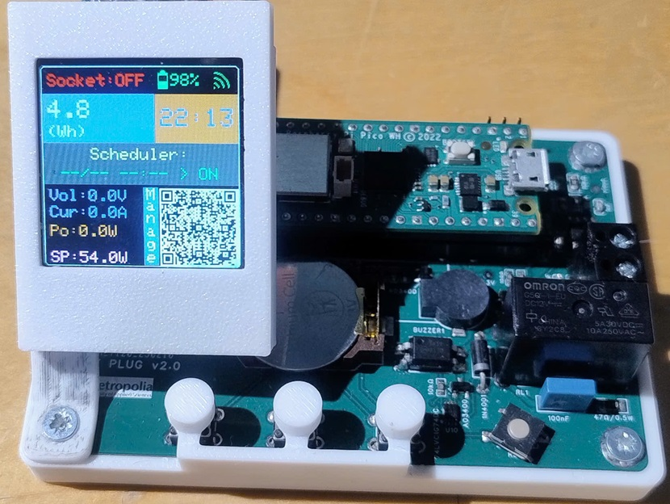

# 🔌 Smart Plug IoT Project

This repository contains the implementation details for the Smart Plug, a third-year IoT project developed at Metropolia University of Applied Sciences by Mong Phan, Nadim Tran, Phuong Duong, and Xuan Dang, submitted on March 12, 2025.   
A complete end-to-end IoT smart plug system, designed from scratch, from custom PCB layout to firmware
              development and final functionality testing. Built on Raspberry Pi Pico W and FreeRTOS, the system uses a
              modular, multi-tasking architecture with rich inter-task communication via queues, semaphores, and event
              groups to manage concurrent operations such as power sensing, MQTT communication, OTA updates, LCD display
              control, and safety enforcement. Features include real-time power tracking with ACS712, configurable power
              limits, a full-color local display, remote scheduling, and secure cloud interaction via MQTT. This project
              showcases a full-stack embedded design approach integrating hardware, firmware, cloud services, and
              front-end control.

## 📖 Project Report

The full project report is available at [Smart_Plug_Project_Report_G7.pdf](Smart_Plug_Project_Report_G7.pdf).

## 📝 Project Overview

The **Smart Plug** addresses limitations in existing commercial smart plugs, such as the absence of onboard displays, fixed power thresholds, and rigid interfaces. Built on the **Raspberry Pi Pico W** microcontroller, it integrates **FreeRTOS** for real-time task management, **MQTT** for secure cloud communication with the server, and an **ACS712** current sensor for precise power monitoring. Key features include:

- **🔄 Remote Control**: Toggle appliances on/off remotely via a web interface.
- **📊 Real-Time Energy Monitoring**: Track voltage, current, and power consumption on a 1. TFT LCD display.
- **⚡ User-Defined Power Limits**: Set adjustable power setpoints with hardware and software over-current protection (OCP at 4.5A).
- **⏰ Automated Scheduling**: Configure on/off timers for efficient appliance operation.
- **💾 Persistent Storage**: Store settings and energy data in I2C EEPROM across power cycles.
- **🌐 OTA Updates**: Support firmware updates over-the-air (OTA) for maintenance.

The system uses a custom PCB, a cloud-based MQTT broker (HiveMQ), and a React.js front-end with a Python FastAPI back-end. It serves both practical consumer needs and educational purposes, enabling students to apply IoT concepts in an end-to-end solution.

## 🛠 Prerequisites

### 🔧 Hardware
- Raspberry Pi Pico W
- 1.54" SPI TFT LCD (ST7789 controller, 240x240 pixels)
- ACS712-05B current sensor (5A, 185 mV/A)
- STMicroelectronics M24256-BRMN6TP I2C EEPROM (256 Kbits)
- Microchip MCP79410-I/MS I2C RTC with battery backup
- 12V relay for switching
- Hardware OCP circuit (comparator, D-type flip-flop)
- 12VDC, 5A power adapter

### 💾 Software
- **Firmware**: C with FreeRTOS and Pico SDK
- **Frontend**: Node.js (v16+), React.js, Tailwind CSS
- **Backend**: Python 3.8+, FastAPI, Paho-MQTT

## 🚀 Usage

1. **🔌 Power Up**:
   - Connect the smart plug to the 12V power supply. The LCD displays initial status (socket state, Wi-Fi, etc.).

2. **🌐 Connect to Wi-Fi**:
   - Press the left button for 3 seconds to enter Access Point (AP) mode.
   - Scan the LCD QR code or connect to the plug’s Wi-Fi (IP: 192.168.4.1).
   - Enter router SSID and password via the web interface or QR code.

3. **⚙️ Configure Settings**:
   - **Setpoint**: Use the web app to set a power limit (max 4.5A).
   - **Schedules**: Add timers (date, time, on/off) via the web app’s scheduling interface.
   - **Toggle Socket**: Press the right button or use the web app to turn the appliance on/off.

4. **📊 Monitor Energy**:
   - View real-time voltage, current, and power on the LCD.
   - Check historical consumption (day/month/year) via the web app’s charts.

5. **🔄 OTA Updates**:
   - Trigger firmware updates via the web app, which the OTA Task processes using MQTT and HTTP.

6. **🔔 Alerts**:
   - The buzzer beeps for state changes, OCP triggers, or button presses.
   - The LCD shows “Socket: OL” for over-current events.

## 🧪 Testing and Validation

The system was rigorously tested for:
- **📏 Algorithm Accuracy**: Load current (±2%), power consumption (±3%), and RTC drift (<1s/24h).
- **🎮 System Control**: Socket toggle (100% success, <50ms), OCP response (<200ms), and timer accuracy.
- **⚡ System Performance**: Stable over 48 hours, 120ms latency, 98% MQTT delivery rate, and ±1% energy reporting.

## ⚠️ Limitations and Future Work

- **🚫 Limitations**:
  - Limited to 5A loads due to ACS712 sensor.
  - MQTT latency in unstable networks.
  - No integration with Alexa/Google Home.
- **🔮 Future Improvements**:
  - Support higher current loads with upgraded sensors.
  - Add smart home ecosystem compatibility.
  - Enhance the web app with ML-based usage predictions.
  - Integration of multiple devices with different IDs

---

## 📌 Contributors

- **Mong Phan**
- **Nadim Ahmed**
- **Xuan Dang**
- **Phuong Ta**

---

## ⚖️ License

This project was developed for academic purposes at **Metropolia University of Applied Sciences**. User can freely use this project for educational purpose ONLY.
